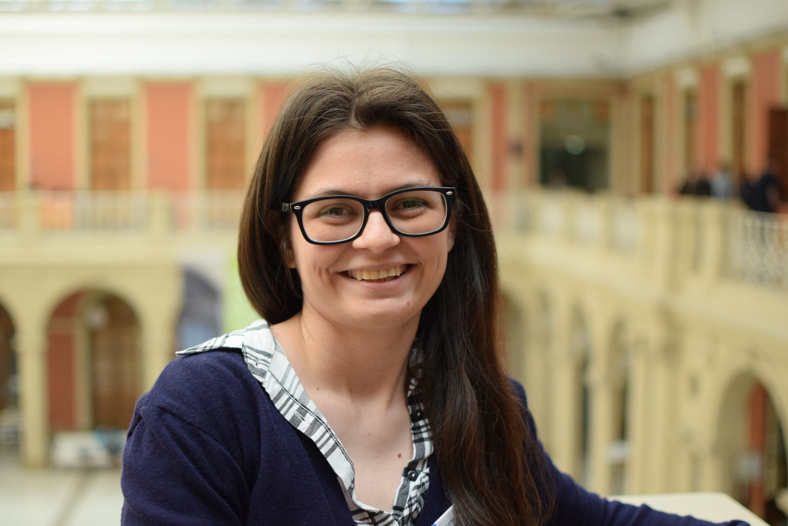

```{r, include=FALSE}
knitr::opts_chunk$set(
  results='asis', 
  echo = FALSE
)
library(tidyverse)
library(glue)

# Set this to true to have links turned into footnotes at the end of the document
PDF_EXPORT <- FALSE

# Holds all the links that were inserted for placement at the end
links <- c()

source('parsing_functions.R')

library(readr)
# First let's get the data, filtering to only the items tagged as
# Resume items
position_data <- read_csv2('excel-cv.csv')

```


Aside
================================================================================




Contact {#contact}
--------------------------------------------------------------------------------


- <i class="fa fa-envelope"></i> noelia0618@gmail.com
- <i class="fa fa-twitter"></i> data_datum
- <i class="fa fa-github"></i> github.com/data-datum
- <i class="fa fa-link"></i> [Roxana Noelia Villafañe](roxananoelia.netlify.com/)
- <i class="fa fa-phone"></i> +54 03794 327730


Made w/ [**pagedown**](https://github.com/rstudio/pagedown)
and [**Nick Strayer**](https://github.com/nstrayer/cv) template


Source code: [github.com/data-datum/cv](https://github.com/data-datum/cv).

Last updated on `r Sys.Date()`.


Main
================================================================================

ROXANA NOELIA VILLAFAÑE {#title}
--------------------------------------------------------------------------------

```{r}
intro_text <- "


"


cat(sanitize_links(intro_text))
```


Education {data-icon=graduation-cap data-concise=true}
--------------------------------------------------------------------------------

```{r}
position_data %>% print_section('education')
```


Research Position {data-icon=suitcase}
--------------------------------------------------------------------------------


```{r}
print_section(position_data,'research_position')
```

Teaching Experience {data-icon=chalkboard-teacher}
--------------------------------------------------------------------------------

```{r}
print_section(position_data,'teaching_position')
```

Awards and Fellowships {data-icon=medal}
--------------------------------------------------------------------------------
```{r}
print_section(position_data,'awards')
```

Publications {data-icon=book}
--------------------------------------------------------------------------------

```{r}
print_section(position_data,'publications')
```

Communities Project {data-icon=users}
----------------------------------------------------------------------------------
::: aside
Communities Social Media
- <i class="fa fa-twitter"></i>[Twitter](https://twitter.com/rladies_rciacte)
<br>
- <i class="fa fa-twitter"></i>[Twitter](https://twitter.com/NeaRenel)
:::

```{r}
print_section(position_data,'communities')
```


Talks {data-icon=chart-line}
--------------------------------------------------------------------------------
::: aside
All my talks available at
- <i class="fab fa-speaker-deck"></i> [Speakerdeck](https://speakerdeck.com/noelia0618)

:::

```{r}
print_section(position_data,'talks')
```


